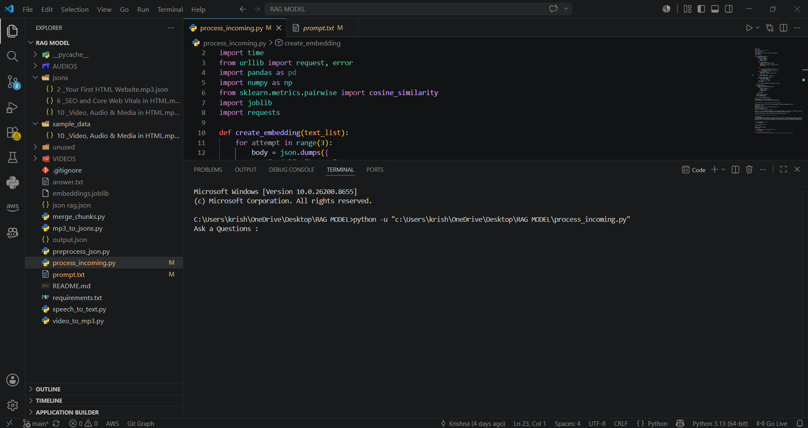
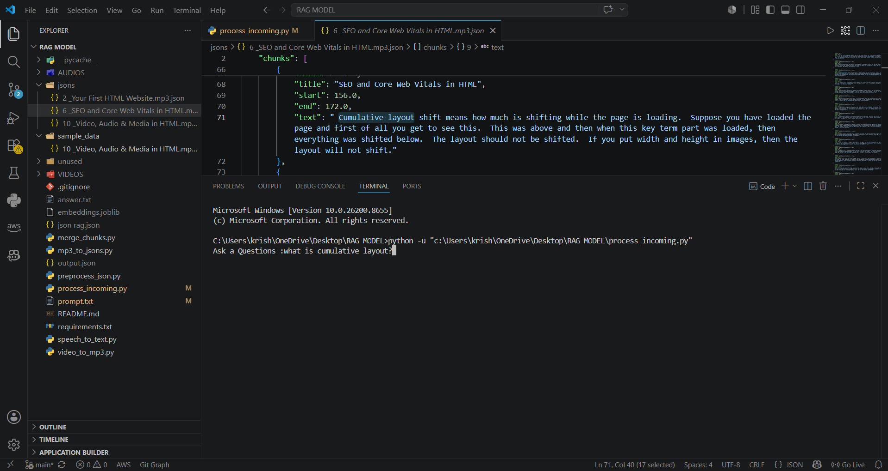
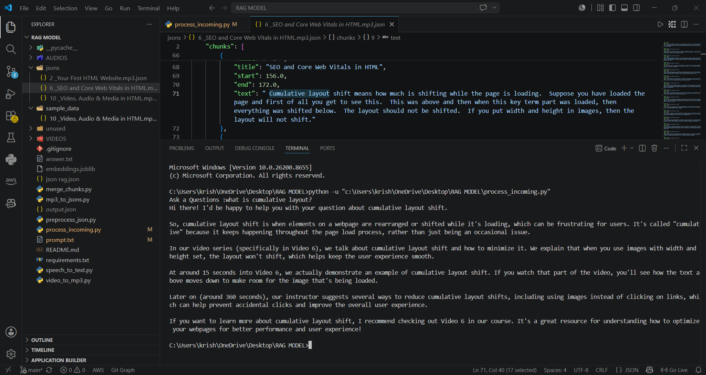

# RAG AI Teaching Assistant

An AI-powered educational search engine that allows students to ask questions across an entire course and instantly discover:

* Which video contains the topic
* The exact timestamp where it is taught
* A concise explanation generated from the lecture content

Instead of manually searching through 50–100 lecture videos, students can simply ask a question such as:

> "Where is SEO taught?"
>
> "Which video explains HTML Audio and Video tags?"
>
> "Where can I learn about Core Web Vitals?"

The system searches through video transcripts, retrieves the most relevant lecture segments, identifies the corresponding video and timestamp, and generates an answer using a local Large Language Model.


## Demo

### Ask a Question



### Enter Your Query



### Get Video, Timestamp and AI Explanation




---

## Key Features

### Course-Wide Search

Search across an entire course containing dozens or even hundreds of videos.

### Timestamp Retrieval

Find the exact video and timestamp where a topic is discussed.

Example:

Question:
"Where is SEO taught?"

Output:

* Video: SEO and Core Web Vitals in HTML
* Timestamp: 12:34
* Explanation: SEO improves a website's visibility in search engines...

### AI-Powered Explanations

The system not only locates the topic but also generates a concise explanation based on the lecture content.

### Fully Local AI Pipeline

Runs locally using Ollama without requiring paid APIs.

### Semantic Search

Uses embeddings instead of keyword matching, allowing users to find concepts even when different wording is used.

---

## How It Works

```text
Course Videos
      ↓
Audio Extraction
      ↓
Whisper Transcription
      ↓
Transcript Processing
      ↓
Chunk Creation
      ↓
BGE-M3 Embeddings
      ↓
Semantic Search
      ↓
Relevant Video + Timestamp Retrieval
      ↓
Llama 3.2 (Ollama)
      ↓
Answer + Learning Location
```

---

## Example Queries

### Query 1

"Where is SEO taught?"

Output:

* Video Name
* Timestamp
* Explanation of SEO

### Query 2

"In which lecture are HTML audio and video tags explained?"

Output:

* Relevant Video
* Start Timestamp
* Brief Summary

### Query 3

"What are Core Web Vitals?"

Output:

* Related Lecture Segment
* Timestamp
* AI-Generated Explanation

---

## Tech Stack

* Python
* Ollama
* Llama 3.2
* BGE-M3 Embeddings
* Whisper
* Pandas
* NumPy
* Scikit-Learn
* Joblib

---

## Installation

### Install Python Dependencies

```bash
pip install -r requirements.txt
```

### Install Ollama

```bash
ollama pull llama3.2
ollama pull bge-m3
```

Start Ollama:

```bash
ollama serve
```

---

## Usage

### Step 1: Add Course Videos

Place all course videos inside the videos directory.

### Step 2: Convert Videos To Audio

```bash
python video_to_mp3.py
```

### Step 3: Generate Transcripts

```bash
python speech_to_text.py
```

### Step 4: Convert To Structured JSON

```bash
python mp3_to_jsons.py
```

### Step 5: Generate Embeddings

```bash
python preprocess_json.py
```

### Step 6: Ask Questions

```bash
python process_incoming.py
```

Example:

```text
Where is SEO taught?
```

The system returns:

* Relevant video
* Timestamp
* Context
* AI-generated answer

---

## Future Improvements

* FAISS Vector Database
* Streamlit Web Interface
* Multi-Course Search
* PDF and Notes Support
* Hybrid Search (Keyword + Embeddings)
* Course Analytics Dashboard
